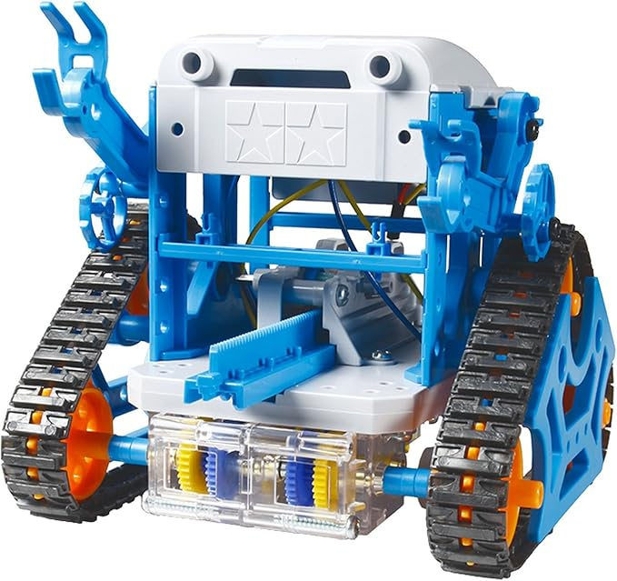
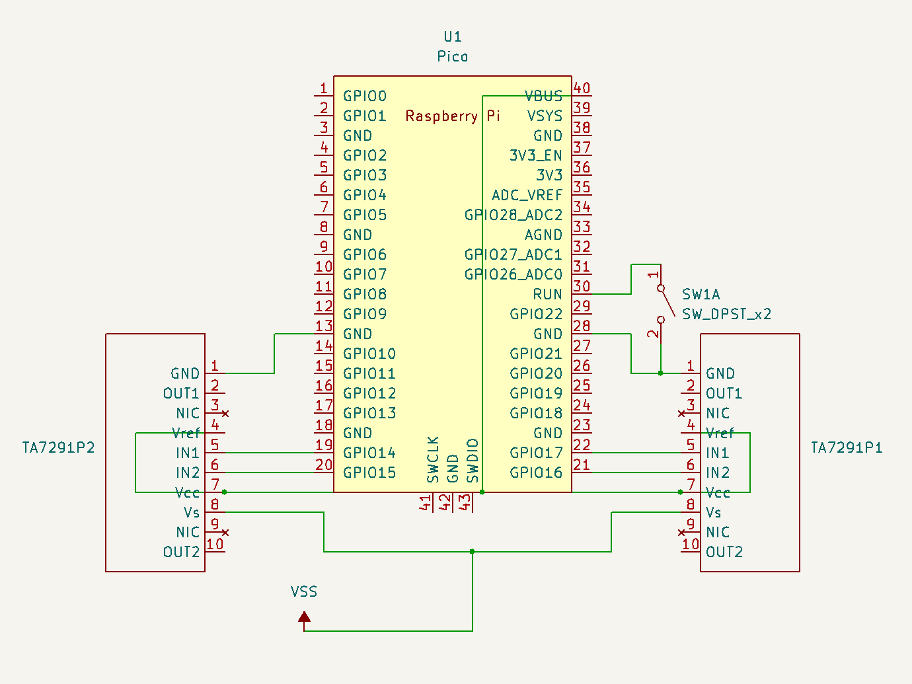

# Raspberry Pi Robot


- Raspberry Pi Pico WとTA7291P(終売品)を組み合わせてタミヤのカムロボットを制御するリポジトリ

## 回路図(簡易版)



## セットアップ
0. ロボットと回路を組み立てる
1. `image/RPI_PICO_W-20260406-v1.28.0.uf2` をRaspberry Pi Pico Wにドラッグ&ドロップ
2. `main.py` と `lib/OpenPort.py` をRaspberry Pi Pico Wにコピー&ペースト(Thonny推奨)
3. `config.jsonの作成`
```json
{
    "wi-fi" :{
        "ssid" : "Wi-Fi 2.4GHz対応SSID",
        "password" : "Wi-Fi 2.4GHz対応パスワード",
        "netmask" : "ネットマスク",
        "gateway" : "デフォルトゲートウェイのIPアドレス",
        "dns" : "DNSサーバのIPアドレス"
    },
    "ntp" :{
        "host" : "NTPサーバのIPアドレス",
        "offset" : 9
    },
    "weekday" :[
        "Mon",
        "Tue",
        "Wed",
        "Thu",
        "Fri",
        "Sat",
        "Sun"
    ]
}
```
4. `main.py`のIPアドレスを設定したいIPアドレスに変更
5. `transmitter/TX.py` で制御(簡易版なのでUI等は整えてください)